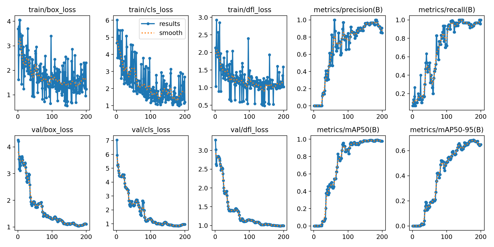

# HARAM AVAILABLE SPOT DETECTION 

This project is a Streamlit-based application that uses YOLOv8 object detection to identify available prayer spots from uploaded videos or images.

The model achieves high accuracy for available prayer spots. The training metrics below demonstrate stable convergence with final performance metrics of 0.977 precision, 0.97 recall, and mAP@0.5 of 0.977.

<div align="center">
  
</div>


This is how the overall architecture and design of the system works, illustrating how user inputs, YOLOv8 detection, database operations, and output visualization are connected in a streamlined workflow.


<div align="center">
  
</div>


## Live Demo
The application is deployed and accessible at:

[Haram Available Spot Detection Version 2](https://haramspotfinder-jtdjgfnngqvpanhdtjh9ey.streamlit.app/)

[Haram Available Spot Detection Version 1](https://haramspotfinder-f2ntqrqjzygjc6g9hzhov9.streamlit.app/)


### Installation & Setup

#### 1. Environment Setup
##### Create conda environment
```bash
conda create -p venv python==3.9.0 -y
```

##### Activate environment
```bash
conda activate ./venv
```

#### 2. Clone Repository:
`git clone https://github.com/Abdisamad001/Haram_Spot_Finder.git` 

#### 3. Install Dependencies
```bash
pip install -r requirements.txt
```

#### 4. Run Application 
```bash
streamlit run app.py
```

#### 5. To Test the inference 

Go to `data` folder -> `val` --> images 


#### Quick Click For DIR
[Click Here for image DIR](https://github.com/Abdisamad001/Haram_Spot_Finder/tree/main/data/val)
